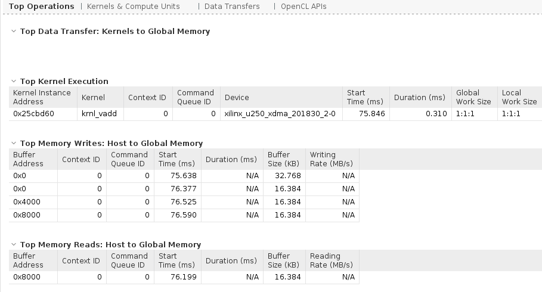
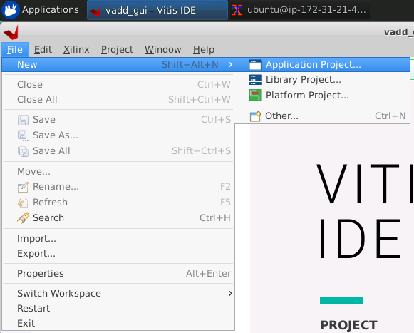
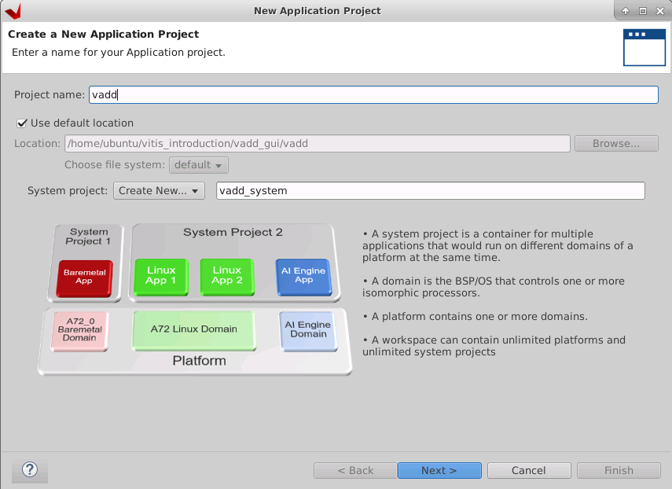
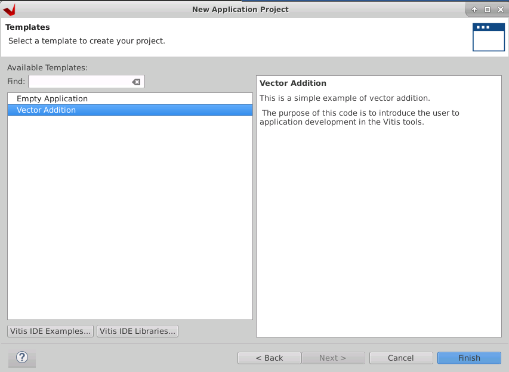
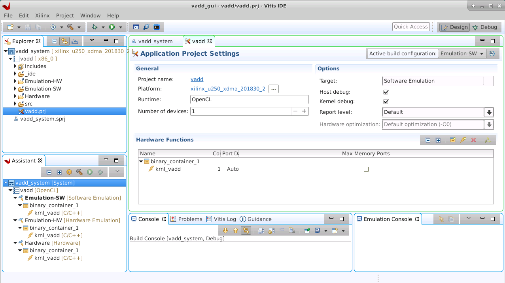
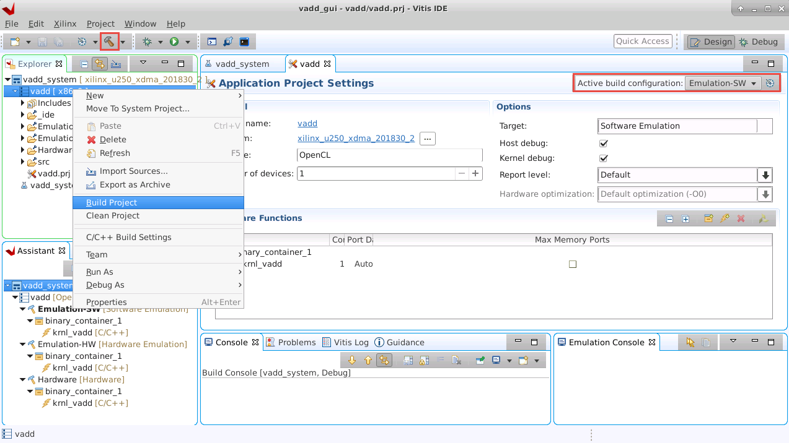
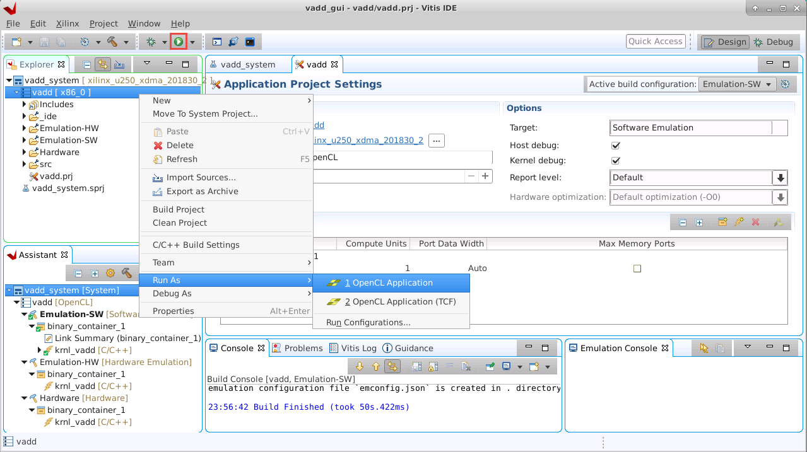
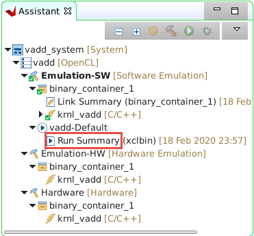
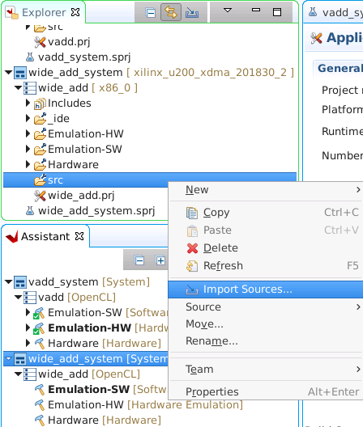
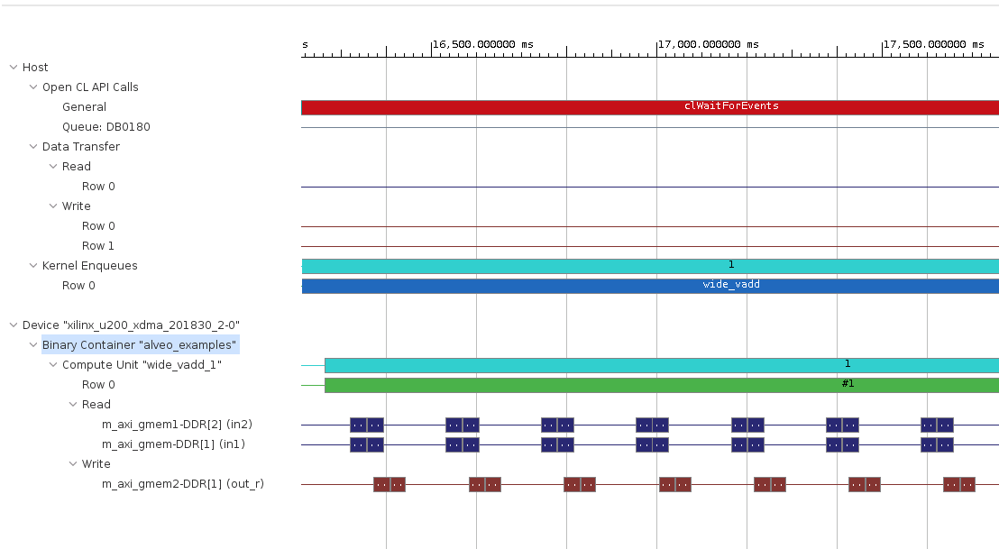

# Tutorial Name: Vitis Introduction: Acceleration Workflow

## Introduction

In this tutorial, you'll get your hands on Vitis tools to experience its hardware acceleration features. 

Taking advantage of unification of SDSoC and SDAccel, Vitis hardware acceleration can work for both edge and cloud applications, targeting ZCU102, ZCU104, or Alveo U200, U250, U280 boards. This Tutorial will use Alveo U200/U250 as a target platform.

This tutorial has several sections. After getting familiar with tutorial environment in section 1, we'll try an "Hello World" application using Vitis in section 2. Section 3 is an extension of section 2, which would use several common optimization methods to improve the kernel's bandwidth. 

The algorithm in section 2 and 3 for demonstration is simply vector addition. Section 4 gives an example of accelerating OpenCV functions, which sounds more complex, but it's still easy to use and understand.

Due to the tutorial time limitation, we'll work on software emulation only. Software emulation is more for function validation rather than performance evaluation. The real performance needs to get from hardware running. If you're interested in how to deploy the developed application to hardware, please read the last chapter [Next Steps](#next-steps) for more info.

### Tutorial Objectives

After completing this tutorial, you will learn:

- The basic Vitis workflow
- The basic Kernel optimization options
- How to use Vitis Libraries to accelerate your development

### Table of Contents

- [Lab Name: Vitis Introduction: Acceleration Workflow](#Lab-name-vitis-introduction-acceleration-workflow)
  - [Introduction](#introduction)
    - [Tutorial Objectives](#Tutorial-objectives)
    - [Table of Contents](#table-of-contents)
  - [Section 1: Get Familiar with Tutorial Environment](#section-1-get-familiar-with-Lab-environment)
    - [Section 1a: Get Familiar with AWS Environment](#section-1a-get-familiar-with-aws-environment)
    - [Section 1b: Xilinx Tool Environment](#section-1b-xilinx-tool-environment)
    - [Section 1c: Get Lab Contents](#section-1c-get-Lab-contents)
    - [Section 1d: Lab Structure](#section-1d-Lab-structure)
    - [Section 1 Summary](#section-1-summary)
  - [Section 2: the 'Hello World' for Vitis Acceleration Flow](#section-2-the-hello-world-for-vitis-acceleration-flow)
    - [Section 2a: Build in Makefile Flow](#section-2a-build-in-makefile-flow)
    - [Section 2b: Check Emulation Timeline and Profile Summary](#section-2c-check-emulation-timeline-profile-summary)
    - [Section 2c: Build in GUI Flow](#section-2b-build-in-gui-flow)
    - [Section 2d: Understand the Project Structure](#section-2d-understand-the-project-structure)
    - [Section 2e: Take a Look at Vadd Acceleration Kernel](#section-2e-take-a-look-at-vadd-acceleration-kernel)
    - [Section 2f: What's in Host Code](#section-2f-whats-in-host-code)
    - [Section 2g: Perform hw_emu in CLI mode (Optional)](#section-2g-perform-hw_emu-in-CLI-mode)
    - [Section 2 Summary](#section-2-summary)
  - [Section 3: Wide Vadd](#section-3-wide-vadd)
    - [Section 3a: Build Project with CLI Flow](#section-3a-build-project-with-cli-flow)
    - [Section 3b: Build and Run the Project with GUI Flow](#section-3b-build-and-run-the-project-with-gui-flow)
    - [Section 3c: Wider Bandwidth - the Wide Vadd Kernel](#section-3c-wider-bandwidth---the-wide-vadd-kernel)
    - [Section 3d: Use Exclusive Memory Bandwidth](#section-3d-use-exclusive-memory-bandwidth)
    - [Section 3 Summary](#section-3-summary)
  - [Section 4: Use Vitis Vision Library to Accelerate More Functions](#section-4-use-vitis-vision-library-to-accelerate-more-functions)
    - [Section 4a: Build and Run Project in CLI Mode](#section-4a-build-and-run-project-in-cli-mode)
    - [Section 4b: Understand OpenCV resize()](#section-4b-understand-opencv-resize)
    - [Section 4c: Understand Code Snippet of cv::resize(), xf::resize()](#section-4c-understand-code-snippet-of-cvresize-xfresize)
    - [Section 4d: Pipelining Operations with OpenCV](#section-4d-pipelining-operations-with-opencv)
    - [Section 4 Summary](#section-4-summary)
  - [Lab Summary](#Lab-summary)
  - [Next Steps](#next-steps)
  - [Common Errors](#common-errors)
    - [[XRT] ERROR: No devices found](#xrt-error-no-devices-found)
    - [[XRT] ERROR: No such CU at address](#xrt-error-no-such-cu-at-address)
    - [CMake Error: alveo_examples_u200.xclbin does not exist](#cmake-error-alveo_examples_u200xclbin-does-not-exist)


## Section 1: Get Familiar with Tutorial Environment

Duration: 5-10 min

### Section 1a: Get Familiar with AWS Environment

**Step 1: Log in to AWS and Start the Instance**

You should have received a piece of paper/email which has the Account ID, IAM
user name, and password for a unique AWS AMI. 

Begin by using your web browser to open the following URL:
console.aws.amazon.com/ec2/v2/home?region=us-west-2#Instances:tag:Name=**\<your IAM user name\>**;sort=tag:Name

For example, if your user name is "user7", the correct URL would be:
https://console.aws.amazon.com/ec2/v2/home?region=us-west-2#Instances:tag:Name=User7;sort=tag:Name

Log in with your assigned account ID, user name, and password as shown
in the following figure:


You will see a list of AWS instances. Select the instance associated
with your user name, noting that there are many attendees and you may have to scroll a bit to find yours (there is a
search/filter function available at the top of the screen to enter your user name).
One you've located it click **Actions** -\> **Instance State**
-\> **Start** as shown in the following figure:


Each instance takes approximately 10 to 20 seconds to start, and you
will need to refresh your browser in order to see the status update.
Once the instance has booted the state will display as "running" and you
will see an IPv4 public IP address associated with your Amazon instance as shown in the
following figure. Take note of this address as you will use it in
subsequent steps to connect to the instance and access the tutorial software
environment.


There are two ways to connect to the instance: SSH and RDP.

**Note:** This tutorial requires the use of the Vitis GUI, and Xilinx has found connecting through
RDP to generally be more responsive than SSH tunneling and/or VNC for AWS instances. As RDP clients
are available on most systems instructions for RDP are provided here.

**Step 2: Connect to the AWS AMI Using RDP**

The instance you started should be configured with an RDP server. To
connect:

From your local laptop, start a remote desktop client

-   **Windows:** press the Windows key and type "remote desktop"

    -   You should see the "Remote Desktop Connection" application in
        the list of programs

    -   If you do not, alternatively you can type **mstsc.exe** in the
        Windows run prompt

-   **Linux:** RDP clients such as Remmina and Vinagre are suitable

-   **macOS:** Use the Microsoft Remote Desktop app from the Mac App
    Store

In the remote desktop client, enter the public IPv4 address of your instance. If you are unsure where
to find it please refer back to the prior figure.

**IMPORTANT:** Before connecting, set your remote desktop client to use
**24-bit or lower color depth**. This is a shared network environment
with many people on WiFi, your performance (and theirs) will be degraded
with higher bandwidth utilization.

On Windows, in the bottom-left corner of the connection prompt click
**Options**, then select the Display tab and set Colors to True Colors
(24-bit).

Click **Connect** (or equivalent) to connect to the remote system.

**Note:** You may see a message about untrusted connection certificates.
If so, click **Yes** to dismiss this message. Your remote desktop client
should prompt you to log in.

Log in with the following credentials:

-   User: **ubuntu**
-   Password: <will be provided by the instructor>

Note that it is possible that the username and password you were
provided for your use during the session may not match the above. In the
event of a discrepancy you must use the **provided login and password**.

It is possible that the RDP connection may fail on the first attempt.
Typically connecting a second time resolves the issue.

Open a new terminal as shown in the following figure:


### Section 1b: Xilinx Tool Environment

To enable Xilinx tools from terminal, please run the following commands:

```bash
# Setup Vitis tool environment variables
source /tools/Xilinx/Vitis/2019.2/settings64.sh
# Setup XRT environment
source /opt/xilinx/xrt/setup.sh
# Check Platform path
echo $PLATFORM_REPO_PATHS
# if empty, set path: export PLATFORM_REPO_PATHS=<platform root path>
ls $PLATFORM_REPO_PATHS
# Expectation: xilinx_u200_xdma_201830_2 xilinx_u250_xdma_201830_2
```

XRT and Platforms are pre-installed. Platform is installed in the environment `$PLATFORM_REPO_PATHS` points to. Default location would be `/opt/xilinx/platforms`. The tutorial files are referring to this environment variable to find the corresponding platforms.

OpenCV 4.1.1 is installed on host because Section 4 requires OpenCV to be installed on host.

Note: If you open new shells, these environment initializations needs to be done again in that shell.

### Section 1c: Get Lab Contents

Lab contents are located in directory `/home/ubuntu/Labs/Vitis/introduction`. Please copy it to your home directory for further labs.

```bash
mkdir ~/vitis_introduction
cp -r /home/ubuntu/Labs/Vitis/introduction/lab-files ~/vitis_introduction
cd ~/vitis_introduction/lab-files
```

The environment setup listed in Section 1b is prepared in lab-files directory. Run `source setup.sh` can setup the tools for Vitis.

Every lab sub-directory has `run.sh`, which lists all the commands for building and running the lab. While it's encouraged to type in commands for better memorize commands, using this script could save time or verify results.

### Section 1d: Lab Structure

All the labs are using a similar file structure. In each lab directory, `hw_src` directory describes the acceleration kernel, while `sw_src` describes the host code. After compiling, host code executable controls kernel with the help of XRT - Xilinx RunTime. For more info of XRT, you're welcome to join the related session, and refer to its document at https://xilinx.github.io/XRT/

### Section 1 Summary

This lab section guided you through connecting to AWS instance, setting up tools environment, and provided directory structure for the labs. 

## Section 2: the 'Hello World' for Vitis Acceleration Flow

Welcome to the first real section to get your hands dirty. All programming tutorials begins with an example of "Hello World". The "Hello World" for hardware acceleration is vector addition. You will be introduced to Vitis acceleration workflow with this "Hello World" application.

Vitis supports both scripting flow and GUI flow, just like any software programming language. The underneath compiler structure is similar to software programming language as well. In software, it's `gcc` or `g++` for compiling and linking; in hardware, it is `v++`. V++ calls HLS compiler to synthesize C/C++/OpenCL kernel to HDL, and calls Vivado for kernel compiling, linking them together and generating final hardware output.

Note: In section 2a and 2b, instructions for CLI flow and GUI flow are both provided. Only select the preferred flow and build once. You don't need to build it in both flows. 

### Section 2a: Build in Makefile Flow

If you're familiar with Makefile, comfortable with reading and writing compiler options in plain text, Makefile flow is for you. Makefile managed project is easy to reproduce and version control.

Step 1: Build hw_src in Makefile Flow

```bash
cd ~/vitis_introduction/lab-files/vadd/hw_src
make
```

Step 2: Build software

```bash
cd ../sw_src
make
```

Step 3: Run Software Emulation
```bash
# Assume it's now in vadd/sw_src directory
# Generate emulation configuration file by selecting hardware platform 
emconfigutil  -f xilinx_u250_xdma_201830_2
# Copy hardware to same directory
cp ../hw_src/alveo_examples.xclbin .
# Tell XRT this is a software emulation, then launch the host executable
export XCL_EMULATION_MODE=sw_emu
./vadd alveo_examples.xclbin
```

Expected Output
```
Loading: 'alveo_examples.xclbin'
TEST PASSED
```

Please refer to the `Makefile` in `hw_src` and `sw_src` for more compilation detailed steps. Section 2d would explain the details about compilation flow.

### Section 2b: Check Emulation Timeline and Profile Summary

Since CLI mode is used, run `vitis_analyzer &` from the sw_src directory to open Vitis Analyzer GUI. Use `File -> Open Directory`, browse to *vitis_introduction/lab-files/vadd/sw_src* and click **select**, click **OK** to open the vadd run directory. Click **OK** again to ignore the error message.

Vitis Analyzer shows Profile Summary and Application Timeline

Click on the **Application Timeline** button on left to open the timeline. Scroll to right and click magnifying button to see various activities.


Click on the **Profile Summary** button on left to open the multi-tab Profile Summary.



Click through various tabs and note that (i)there is no information in the *Data Transfers* tab, (ii)the *Kernels a& Compute Units* tab shows number of kernels and compute unit utilization, and (iii)the *OpenCL APIs* tab lists various called API, frequencies, and duration of each API call.

Close the analyzer by clicking `File -> Exit` and clicking **OK**.

### Section 2c: Build in GUI Flow

Step 1: Launch Vitis GUI

Make sure Vitis and XRT environment has been setup by the descriptions in Section 1b: Xilinx Tool Environment

```bash
vitis &
```

We setup XRT before launching vitis because building and running acceleration applications requires XRT.

Set workspace to any empty folder, such as `/home/ubuntu/vitis_introduction/vadd_gui` and click **Launch**.  The Vitis IDE Welcome page will be displayed.


Step 2: Create a new acceleration project

Use `Create Application Project` from Welcome page, or use Menu `File -> New -> Application Project` to create a new application.

Close Welcome page.



Give a name `vadd`, click next.



Select Platform `xilinx_u250_201830_2`, click next


Select `Vector Addition`, click Finish.



The project is generated.




Step 3: Build for software emulation

Set `Active build configuration` to `Emulation-SW` on the upper right corner of Application Project Settings view, or top icon bar.

Begin build by clicking the little hammer icon on top icon bar, or right click `vadd` and select `Build Project`



Step 4: Run Software Emulation in GUI Mode

To launch software emulation in GUI mode, first select the application in Explorer window, then click run icon on icon bar, or right click application and select `Run As -> OpenCL application`



Step 5: Check Emulation Timeline

Since GUI mode is used, double click `Emulation-SW -> vadd-Default -> Run Summary (xclbin)` in Assistant view to open Vitis Analyzer.



Vitis Analyzer shows Profile Summary and Application Timeline panels on left


### Section 2d: Understand the Project Structure

The whole acceleration project is composed by two parts: kernel code and host code. Kernel code is to be implemented and run on FPGA, or Alveo card; host code is to be run on host, which can be either x86 CPU, Power9 CPU, or ARM CPU. Host code uses XRT (Xilinx Run Time) to communicate with acceleration kernel, through PCIe or AXI.


Kernel code is compiled by v++. In hardware Makefile flow, `.xo` and `.xclbin` are generated by v++ compiler. `.xo` is kernel; `.xclbin` is the implemented FPGA image that can be configured to FPGA.

In GUI flow, functions marked in `Hardware Functions` region will be compiled by v++ and linked together to `.xclbin` finally. The rest source files will be compiled by GCC, taken as host code.

In software compilation flow, host code can be managed and compiled separately using Makefile. In this section, Makefile is used. In next the next section, CMake will be used to generate Makefile.

In GUI flow, it would be fine if an application project only contains kernel code or host code. Vitis can build the project properly.

### Section 2e: Take a Look at Vadd Acceleration Kernel

Kernel code `vadd/hw_src/krnl_vadd.cpp` is well commented. Please take some time to glance through the code.

Step 1: Define kernel interface

```C++
void krnl_vadd(const unsigned int *in1, // Read-Only Vector 1
          const unsigned int *in2, // Read-Only Vector 2
          unsigned int *out_r,     // Output Result
          int size                 // Size in integer
) 
```

Step 2: Define interface AXI binding

Kernel must have one and only one s_axilite interface which will be used by host application to configure the kernel. Here bundle control is defined which is s_axilite interface and associated with all the arguments (in1, in2, out and size), control interface must also be associated with "return".

All the global memory access arguments must be associated to one m_axi(AXI Master Interface). Here all three arguments(`in1`, `in2`, `out_r`) are associated to bundle gmem which means that a AXI master interface named "gmem" will be created in Kernel and all these variables will be accessing global memory through this interface.

Multiple interfaces can also be created based on the requirements. For example when multiple memory accessing arguments need access to global memory simultaneously, user can create multiple master interfaces and can connect to different arguments.

```C
#pragma HLS INTERFACE m_axi port = in1 offset = slave bundle = gmem
#pragma HLS INTERFACE m_axi port = in2 offset = slave bundle = gmem
#pragma HLS INTERFACE m_axi port = out_r offset = slave bundle = gmem
#pragma HLS INTERFACE s_axilite port = in1 bundle = control
#pragma HLS INTERFACE s_axilite port = in2 bundle = control
#pragma HLS INTERFACE s_axilite port = out_r bundle = control
#pragma HLS INTERFACE s_axilite port = size bundle = control
#pragma HLS INTERFACE s_axilite port = return bundle = control
```

Step 3: Copy data from memory to internal buffer

```C++
read1: for (int j = 0; j < chunk_size; j++) {
           #pragma HLS LOOP_TRIPCOUNT min=c_size max=c_size
           #pragma HLS PIPELINE II=1
            v1_buffer[j] = in1[i + j];
        }
```

Step 4: Vector addition calculation

```C++
vadd_writeC: for (int j = 0; j < chunk_size; j++) {
           #pragma HLS LOOP_TRIPCOUNT min=c_size max=c_size
           #pragma HLS PIPELINE II=1
            //perform vector addition
            out_r[i+j] = v1_buffer[j] + in2[i+j];
        }
```
This step burst reading B, calculating C and Burst writing to global memory.


Step 5: Loop for more iterations

```C++
for (int i = 0; i < size; i += BUFFER_SIZE) {
        int chunk_size = BUFFER_SIZE;
        //boundary checks
        if ((i + BUFFER_SIZE) > size)
            chunk_size = size - i;

        //read1

        //vadd_writeC

}
```

### Section 2f: What's in Host Code

Host code `vadd.c` in this example is C++ style code with OpenCL API. 

OpenCL is not a must for host code. XRT provides the interface between host and device. XRT provides its own API, as well as OpenCL interface, Python interface and other extensions. OpenCL API is most commonly used in host acceleration code in the industry.

To use OpenCL API in host code, we need to include OpenCL headers. OpenCL has two major versions and several minor versions. More version info can be found at Khronos website: https://www.khronos.org/opencl/. The OpenCL C++ Binding documentation explains the header file compatibility: http://github.khronos.org/OpenCL-CLHPP/.

Generally, we would include `CL/cl2.hpp`.

```C
// OpenCL includes in vadd.h
#include <CL/cl2.hpp>
```
Xilinx provides specific headers for OpenCL. Please include `xocl.h` and `xocl2.h` when necessary. They provide API functions begin with `xocl_*`. Although `xocl.h` and `xocl.c` are added to Vector Addition example by default, they are not being used in this simple example. Removing these two files won't affect the emulation result.

The host code execution in OpenCL API follows some general steps.

1. Program device: download xclbin file
2. Buffer allocation on host
3. Write buffers to device
4. Setup kernel arguments
5. Execute kernel
6. Read back data

The host code in Vector Addition example is well commented and self-explained. Please take some time to glance through the host code `vadd.c`


### Section 2g: Perform hw_emu in CLI mode (Optional)

Try to build and run application in Emulation-HW mode. 

At the command prompt, execute `make clean` in both *hw_src* and *sw_src* directories. Using **vi** editor change *sw_emu* to *hw_emu* in `hw_src/Makefile` and `run.sh` (environment variable `XCL_EMULATION_MODE` need to be taken care) files.

Build the project by running the following command from the vadd directory.

```
./run.sh
```

Run Vitis Analyzer to read the reports, compare with Emulation-SW, could you find some differences?

Note: Emulation-HW build time takes longer time. Launch another shell to run Section 3 while hw is building.

### Section 2 Summary

Key Takeaways:

1. Vitis can run in both CLI and GUI modes. Users are free to pick the one he get used to.
2. V++ has two modes: kernel compiling and system linking; Kernel can be written in C/C++/OpenCL/RTL.
3. Host code can use OpenCL API to control hardware kernel.
4. Vitis Analyzer can virtualize application timeline for understanding the behavior of hardware and software.

## Section 3:  Wide Vadd

In this section, we first show another method to write simple Vadd kernel in C style, because the kernel synthesizer supports C/C++ as well as OpenCL. BTW, RTL is also supported in Vitis hardware acceleration. But if there's no C model provided for this kernel, software emulation cannot run. Only hardware emulation and hardware implementation can be executed.

To achieve the best performance of vector addition, we explore other ways: make the data path wider, not shared with other data.

This example is a part of UG1352. It's recommended to read UG1352 for more in-depth explanations.

**Note**: You may see some host code execution time prints in the following two sections. They are useful for performance evaluation on real hardware, but **NOT** on any kinds of emulations. Software Emulation is good for code correctness checking; Hardware Emulation uses hardware design information and does cycle accurate PL simulation, but using timer on the host side would not match real hardware case.

In this section, we will run application in Hardware Emulation mode because it would show more details than Software Emulation mode. 


### Section 3a: Build Project with CLI Flow

Make sure Vitis and XRT environment is setup properly in your shell. Revisit section 1b or run `source setup.sh` from lab top path to setup environment.

Step 1: Build hw_src in Makefile Flow

```bash
cd ~/vitis_introduction/lab-files/wide_vadd/hw_src
export LIBRARY_PATH=/usr/lib/x86_64-linux-gnu
make
```

In `Makefile`, we have assigned `hw_emu` to `-t`, which means build target for hardware emulation. When running Hardware Emulation on Ubuntu system, the environment variable `LIBRARY_PATH` is needed for XSIM to find proper libraries during compile time.

Step 2: Build sw_src in CMake flow

```bash
cd ~/vitis_introduction/lab-files/wide_vadd
mkdir build
cd build
cmake ..
make -j
```

CMake generates makefile for software application and we build the applications with make.

Step 3: Run Emulation
```bash
cd ~/vitis_introduction/lab-files/wide_vadd/build
# Generate emulation configuration file by selecting hardware platform 
emconfigutil  -f xilinx_u200_xdma_201830_2

# We don't need to copy hardware to same directory manually. CMake helped to do so.
# cp ../hw_src/alveo_examples.xclbin .

# Check emulation mode is set properly
export XCL_EMULATION_MODE=hw_emu

# Setup xrt.ini to generate application timeline
cp ../sw_src/xrt.ini .

# Run all applications
./04_wide_vadd
```


### Section 3b: Build and Run the Project with GUI Flow

Building wide_vadd application in Vitis GUI.

Step 1: Open Vitis with special environment setting for Hardware Emulation
- Close any opened Vitis GUI
- Set environment variable
  - `export LIBRARY_PATH=/usr/lib/x86_64-linux-gnu`
- Launch Vitis `vitis &`
- Keep using previous workspace `vadd_gui`

Step 2: Create a new application
- Create a new application, application name = wide_vadd
- Select platform `xilinx_u200_xdma_201830_2`
- Template = Empty Application
- Select `src` directory in Explorer view, right click and select `Import Sources`
  - Import `wide_vadd/hw_src/wide_vadd.cpp` for hardware accelerator
  - Import all cpp and hpp files in `wide_vadd/sw_src/` for host code application
- Select `wide_vadd()` function as the hardware function
  - Select the flash + icon on wide_vadd application project settings page
  - Select `wide_vadd` function and click OK
  - Rename `binary_container_1` to `alveo_examples` in Hardware Functions table by single clicking the name to edit. This step is to generate the expected xclbin filename, which is hard coded by host code.

Screenshot of Import Source



Screenshot of setting hardware functions


Screenshot of renaming binary container


Step 3: Special Setup for Hardware Emulation
- Add a `HW_EMU` define to host code for proper size buffer
  - Right click `wide_vadd` application in Explorer view, select `C/C++ Build Settings`
  - In `GCC Host Compiler -> Preprocessor`, add `HW_EMU` in `defined symbols` window
  - `HW_EMU` is defined in host source code to use smaller data size as input to save emulation time
  - Click Apply and Close
  - Click Yes to rebuild

Step 4: Set dedicated location of kernel and memory interface
- Right click `wide_vadd -> Emulation-HW` in Assistant view, select `Settings`
- Navigate to wide_vadd kernel, adjust memory and SLR settings according to the screenshot below
- Click Apply and Close


Step 5: Build and run in hardware emulation mode
- Build in Emulation-HW mode
- After build completes, open Run Configurations window
- Set `Working Directory` at Arguments tab (of Run Configurations) to `${workspace_loc:wide_vadd}/Emulation-HW/` because the xclbin location is hard coded in host source code.
- Click Run

### Section 3c: Wider Bandwidth - the Wide Vadd Kernel
Our DDR controller natively has a 512-bit wide interface internally. If we parallelize the data flow in the
accelerator, that means we’ll be able to process 16 array elements per clock tick instead of one. So, we should
be able to get an instant 16x speed-up by just vectorizing the input.

Step 1: Wider kernel interface

`uint512_dt` is used in stead of `unsigned int` here for input, output and internal variables for data storage.

```C
    void wide_vadd(
        const uint512_dt *in1, // Read-Only Vector 1
        const uint512_dt *in2, // Read-Only Vector 2
        uint512_dt *out,       // Output Result
        int size               // Size in integer
    )
```

```C
    uint512_dt v1_local[BUFFER_SIZE]; // Local memory to store vector1
    uint512_dt v2_local[BUFFER_SIZE];
    uint512_dt result_local[BUFFER_SIZE]; // Local Memory to store result
```

Step 2: Check generated kernel interface

1. Open Link Summary with Vitis Analyzer.
2. Select System Diagram
3. Open "Kernels" tab
4. Check the `Port Data Width` parameter


### Section 3d: Use Exclusive Memory Bandwidth

Step 1: The benefits of controlling memory bank of data

On the Alveo cards we have four memory banks available, and while it isn’t necessary with these simple accelerators you may find that you wish to spread operations among them to help maximize the bandwidth available to each of the interfaces. For our simple vector addition example, just for illustration purposes we’ve used the topology shown in following figure.


What we gain by doing this is the ability to perform high-bandwidth transactions simultaneously with different
external memory banks. Remember, long bursts are generally better for performance than many small reads
and writes, but you can’t fundamentally perform two operations on the memory at the same time.

Step 2: Manipulate memory connection in hardware

There are four SLR regions in the FPGA of U250 physically. Each memory controller is resided in a region. To connect a kernel to a memory controller, we need to

1. Assign the kernel's interface to a memory controller
2. Assign the kernel to an SLR region

The option to assign kernel's interface to a memory controller is `sp`; the option to assign kernel to an SLR is `--slr` option. They can be written into config files and given to v++ with `--config` option. For example

config.ini
```ini
[connectivity]
sp=wide_vadd_1.m_axi_gmem:DDR[1]
sp=wide_vadd_1.m_axi_gmem1:DDR[2]
sp=wide_vadd_1.m_axi_gmem2:DDR[1]
slr=wide_vadd_1:SLR2
```

We have done the corresponding settings in GUI in section 3b.

Please note that since the DDR controllers are constrained to different SLR (Super Logic Region), the routing between two SLR may have some challenges in timing closure when `TARGET=hw`. This technique is valuable in the cases where one SLR has two DDR controllers, or in HBM powered devices, such as U280 and U50. Please check Platform Diagram before assigning memory interface and kernel location.


Step 3: Let software make use of the new topology

It’s easy enough to specify the hardware connectivity via command line switches, but when we want to actually
transfer buffers down to the hardware we need to specify which memories to use for XRT. Xilinx accomplishes
this by way of an extension to the standard OpenCL library, using a struct `cl_mem_ext_ptr_t` in combination
with the buffer allocation flag `CL_MEM_EXT_PTR_XILINX`. This looks like the code below.

```C++
// Map our user-allocated buffers as OpenCL buffers using a shared
// host pointer
cl_mem_ext_ptr_t bank_ext;
bank_ext.flags = 2 | XCL_MEM_TOPOLOGY;
bank_ext.obj   = NULL;
bank_ext.param = 0;

cl::Buffer a_buf(context,
                static_cast<cl_mem_flags>(CL_MEM_READ_ONLY | CL_MEM_EXT_PTR_XILINX),
                BUFSIZE * sizeof(uint32_t),
                &bank_ext,
                NULL);
```

Step 4: Verify the results

Use Vitis Analyzer to open time line.

`vitis_analyzer ./timeline_trace.csv &`

Memory read and write by kernel can be observed.




### Section 3 Summary

From a simple vadd application, we explored several steps to increase system performance:
- Expand kernel interface width
- Assign dedicated memory controller
- Use Vitis Analyzer to view the result

V++ provides the ability to use command line options and HLS pragma to control hardware architecture; The extended XOCL class in lab source code provides the ability to make use of specific hardware features.

An advanced lab of taking advantage of data transferring time to do computing in early stage is present in Vitis Advanced Lab. You're welcome to join the Advanced Lab to explore more capabilities of Vitis.


## Section 4: Use Vitis Vision Library to Accelerate More Functions

This would be an interesting section. We'll work on functions a little more complicated. The lab contents of this section is a part of UG1352.

Building blocks are much larger. Building these hardware takes time. Let's launch it first. During building time, we can look down into the background and source code.

### Section 4a: Build and Run Project in CLI Mode

Before starting to build application, please make sure preparing jobs described in [Section 1b](#section-1b-xilinx-tool-environment) has been set if a new shell is launched. 

Step 1: Build hw_src in Makefile Flow

```bash
cd ~/vitis_introduction/lab-files/cv/hw_src
make
```

Step 2: Build sw_src in CMake flow

```bash
cd ~/vitis_introduction/lab-files/cv
mkdir build
cd build
cmake ..
make -j
```

Step 3: Run Software Emulation
```bash
# assuming we are now in cv/build directory
# Generate emulation configuration file by selecting hardware platform 
emconfigutil -f xilinx_u250_xdma_201830_2
# Set Emulation Mode environment variable
export XCL_EMULATION_MODE=sw_emu
# We don't need to copy hardware to same directory manually. CMake helped to do so.
# cp ../hw_src/alveo_examples.xclbin .
# Run all applications
cp ../sw_src/run_app.sh .
cp ../sw_src/xrt.ini .
./run_app.sh
# Run results are saved in txt file for further recap.
```

The software emulation may take some time (about 12 minutes). Please check the generated result images after emulation completes.


### Section 4b: Understand OpenCV resize()

Image processing is a great area for acceleration in an FPGA, and there are a few reasons for it. First and foremost, if you’re doing any kind of pixel-level processing as the images get larger and larger, the amount of computation goes up with it. But, more importantly, they map very nicely to our train analogy from earlier. 

Let’s look at a very simple example: a bilateral resize algorithm. This algorithm takes an input image and scales it to a new, arbitrary resolution. The steps to do that might look something like this: 

1. Read the pixels of the image from memory.
2. If necessary, convert them to the proper format. In our case we’ll be looking at the default format used by the OpenCV library, BGR. But in a real system where you’d be receiving data from various streams, cameras, etc. you’d have to deal with formatting, either in software or in the accelerator (where it’s basically a “free” operation, as we’ll see in the next example).
3. For color images, extract each channel.
4. Use a bilateral resizing algorithm on each independent channel.
5. Recombine the channels and store back in memory.

Or, if you prefer to think of it visually, the operation would look something like this figure


### Section 4c: Understand Code Snippet of cv::resize(), xf::resize()

Step 1: Take a look at OpenCV resize API

The resize() function in API requires three types of information:

1. input and output address
2. target size or resize ratio
3. resize algorithm

```C++
void cv::resize 	( 	InputArray  	src,
		OutputArray  	dst,
		Size  	dsize,
		double  	fx = 0,
		double  	fy = 0,
		int  	interpolation = INTER_LINEAR 
	) 	
```

Step 2: Take a look at xf::cv::resize() API in Vitis_Libraries

The resize() in Vitis vision library requires all the parameters that OpenCV requires when generating hardware:
1. input and output address: `_src` and `_dst`;
2. target size or resize ratio: `SRC_ROWS`, `SRC_COLS`, `DST_ROWS` and `DST_COLS`
3. resize algorithm `INTERPOLATION_TYPE`

Except these information, two additional parameters are required:
1. Pixel type: `xf::cv::resize()` supports 8-bit, unsigned, 1 and 3 channels(`XF_8UC1` and `XF_8UC3`)
2. Number of pixels to be processed per cycle. Possible options are `XF_NPPC1` (1 pixel per cycle) and `XF_NPPC8` (8 pixel per cycle).

```C++
template<int INTERPOLATION_TYPE, int TYPE, int SRC_ROWS, int SRC_COLS, int DST_ROWS, 
        int DST_COLS, int NPC,int MAX_DOWN_SCALE> 
void resize (xf::cv::Mat<TYPE, SRC_ROWS, SRC_COLS, NPC> & _src, 
            xf::cv::Mat<TYPE, DST_ROWS, DST_COLS, NPC> & _dst)
```

Step 3: Define Kernel Interface

Vitis_Libraries provide the acceleration functions that completes the computation on FPGA. The function itself doesn't specify the external interface, e.g. to host, to memory, or to other kernels. They can be regarded as smallest building blocks for acceleration kernels. Multiple library functions can be connected inside a kernel, or working as a standalone kernel but connected and linked in upper level; Vitis library function can also interface custom designed acceleration functions. This design architecture can provide the flexibility for the final acceleration system.

Once it's agreed that Vitis_Libraries is a collection of acceleration functions, it will be easy to understand how to build kernels with Vitis_Libraries functions. It's very similar to the flow that we worked for vadd C kernel.

1. Define kernel interfaces
2. Connect kernel interface with Vitis_Libraries function interfaces

`resize_rgb.cpp` defines kernel interface:
```C++
void resize_accel_rgb(ap_uint<AXI_WIDTH> *image_in,
                          ap_uint<AXI_WIDTH> *image_out,
                          int width_in,
                          int height_in,
                          int width_out,
                          int height_out)

{	
#pragma HLS INTERFACE m_axi port = image_in offset = slave bundle = image_in_gmem
#pragma HLS INTERFACE m_axi port = image_out offset = slave bundle = image_out_gmem
#pragma HLS INTERFACE s_axilite port = image_in bundle = control
#pragma HLS INTERFACE s_axilite port = image_out bundle = control
#pragma HLS INTERFACE s_axilite port = width_in bundle = control
#pragma HLS INTERFACE s_axilite port = height_in bundle = control
#pragma HLS INTERFACE s_axilite port = width_out bundle = control
#pragma HLS INTERFACE s_axilite port = height_out bundle = control
#pragma HLS INTERFACE s_axilite port = return bundle = control
```

Memory interface is defined as pointer `ap_uint<INPUT_PTR_WIDTH> *image_in`, with AXI Master `m_axi` interface. The base address it begins to read is set by AXI Slave port `HLS INTERFACE s_axilite port=image_in`. The bus width is defined by `AXI_WIDTH`. It has a exclusive AXI interface, not combining with the other AXI Master interface `image_out` in kernel level, because their `bundle` name are different.

Step 4: Input and Output Data Type Transformation

Data from kernel interface is passed to `xf::cv::resize()` by `xf::cv::Array2xfMat()`, it transform  pointer type to xfMat type. The output xfMat after processing needs to be transformed back to array to output to memory. It's a reverse of input read flow. 

```C++
xf::cv::Array2xfMat<AXI_WIDTH, TYPE, MAX_IN_HEIGHT, MAX_IN_WIDTH, NPC>(image_in, in_mat);
xf::cv::resize<XF_INTERPOLATION_AREA,
                XF_8UC3,
                MAX_IN_HEIGHT,
                MAX_IN_WIDTH,
                MAX_OUT_HEIGHT,
                MAX_OUT_WIDTH,
                NPC,
                MAX_DOWN_SCALE>(in_mat, out_mat);
xf::cv::xfMat2Array<AXI_WIDTH, TYPE, MAX_OUT_HEIGHT, MAX_OUT_WIDTH, NPC>(out_mat, image_out);

```

Stream attribute is added to the all matrix. It defines the data access pattern is streaming. There would be no random access in these matrix variables. With this attribute, it will not be necessary to keep the whole frame in a buffer. Data flows through the kernel functions. No additional storage is required.

```C++
 xf::cv::Mat<TYPE, MAX_IN_HEIGHT, MAX_IN_WIDTH, NPC> in_mat(height_in, width_in);
        DYN_PRAGMA(HLS stream variable = in_mat.data depth = STREAM_DEPTH)

```


Step 4: Host code

In regards of host software side (cv/sw_src/07_opencv_resize.cpp), parameters can be submitted by `kern.setArg()`. The general workflow is the same as section 2.


### Section 4d: Pipelining Operations with OpenCV
Let’s explore the real beauty of FPGA: streaming. Remember that going back and forth to memory is expensive, so instead of doing that let’s just send each pixel of the image along to another image processing pipeline stage without having to go back to memory by simply streaming from one operation to the next.

In this case, we want to amend our earlier sequence of events to add in a Gaussian Filter. This is a very common pipeline stage to remove noise in an image before an operation such as edge detection, corner detection, etc. We may even intend to add in some 2D filtering afterwards, or some other algorithm.

```C++
//resize_blur.cpp
#pragma HLS DATAFLOW

xf::cv::Array2xfMat<AXI_WIDTH,
                    TYPE,
                    MAX_IN_HEIGHT,
                    MAX_IN_WIDTH,
                    NPC>(image_in, in_mat);
xf::cv::resize<XF_INTERPOLATION_AREA,
                TYPE,
                MAX_IN_HEIGHT,
                MAX_IN_WIDTH,
                MAX_OUT_HEIGHT,
                MAX_OUT_WIDTH,
                NPC,
                MAX_DOWN_SCALE>(in_mat, resized_mat);
xf::cv::GaussianBlur<FILTER_WIDTH,
                      XF_BORDER_CONSTANT,
                      TYPE,
                      MAX_OUT_HEIGHT,
                      MAX_OUT_WIDTH,
                      NPC>(resized_mat, out_mat, sigma);
xf::cv::xfMat2Array<AXI_WIDTH,
                    TYPE,
                    MAX_OUT_HEIGHT,
                    MAX_OUT_WIDTH,
                    NPC>(out_mat, image_out);
                
```

We connect `xf::resize()` and `xf::GaussianBlur()`, keep intermediate variable as stream. They can be connected end to end without taking any additional resources. Since data is not routed to host memory, nor even device global memory, the additional function latency to resize kernel will only be the computation time of `xf::cv::GaussianBlur`.


### Section 4 Summary

Image processing is fun. And it's suitable for FPGA, especially when you're going to connect multiple functions in a chain. Data can be fed from one function to another, they don't even need to go through DDR. The more you connect, the more powerful FPGA solution would be.

## Section 5:  Memory Allocation Tips

In this section, we'd explore the impact of different memory allocation methods. Section 3 is an extension of Vitis Introduction Lab section 3, which introduces a way to process data as early as possible. Section 4 explores the capabilities of v++ to connect kernels in various topologies.

Memory management is a common task in hardware acceleration. A lot of choices need to be made during the design phase: kernel space and user space, normal and physical continuous, aligned and unaligned, coherent and non-coherent, etc. We wish to give common ways of memory allocation in Vitis hardware acceleration applications in this section.

This section is originally a section from UG1352. Section 2 and section 3 share the same hardware design. This section will mainly discuss software application from 01 to 03 in `wide_vadd/sw_src` directory. Section 3 will discuss `wide_vadd/sw_src/05_pipelined_vadd.cpp`

Note: The concepts here are designed for real hardware execution. Software emulation may not be able to accurately reflect the real performance on hardware because memory model in emulation is more of a function model rather than timing model.

### Section 5a: Get Lab Contents

Lab contents are located in directory `/home/ubuntu/Labs/Vitis/advanced`. Please copy it to your home directory for further labs. The environment setup listed in Section 1b is prepared in lab-files directory. Run `source setup.sh` can setup the tools for Vitis.

```bash
mkdir ~/vitis_advanced
cp -r /home/ubuntu/Labs/Vitis/advanced/lab-files ~/vitis_advanced
cd ~/vitis_advanced/lab-files
source setup.sh
```

Every lab sub-directory has `run.sh`, which lists all the commands for building and running the lab. While it's encouraged to type in commands for better memorize commands, using this script could save time or verify results.

### Section 5b: Build Project

The build process in this section builds the contents for both section 2 and section 3.

Step 1: Build hw_src in Makefile Flow

```bash
cd ~/vitis_advanced/lab-files/wide_vadd/hw_src
make
```

Step 2: Build sw_src in CMake flow

```bash
cd ..
mkdir build
cd build
cmake ..
make -j
```

Step 3: Run Software Emulation
```bash
# make sure you are in wide_vadd/build
# Generate emulation configuration file by selecting hardware platform 
emconfigutil  -f xilinx_u250_xdma_201830_2
# We don't need to copy hardware to same directory manually. CMake helped to do so.
# cp ../hw_src/alveo_examples.xclbin .
# Make sure emulation mode is set properly
export XCL_EMULATION_MODE=sw_emu
# Run all applications
cp ../sw_src/run_app.sh .
cp ../xrt.ini .
./run_app.sh > run_on_u250.txt
# Run results are saved in txt file for further recap.
```

### Section 5c: The Importance of Memory Alignment

Simple buffer allocation in application 1 `wide_vadd/sw_src/01_simple_malloc.cpp` may result unaligned buffer.

```C
uint32_t *a = new uint32_t[BUFSIZE];
```

Application 2 `wide_vadd/sw_src/02_aligned_malloc.cpp` gives an example of how to allocate aligned buffer.

```C
posix_memalign((void **)&a, 4096, BUFSIZE * sizeof(uint32_t));
```
Note that for our calls to `posix_memalign()`, we’re passing in our requested alignment, or 4 KiB as previously
noted. Otherwise, this is the only change to the code vs. app01.

The software emulation result shows significate amount time are reduced in task `Set kernel arguments`, from 59ms to 3.5ms. On real hardware, the time saving is reflected in tasks like `Buffer Mapping`, `Write Buffers Out` and `Read Buffer In`. (UG1352 Chapter 3.2) The time shows in the lab may vary due to the performance difference of the CPU on the cloud.

On hardware, time is saved from long burst read and write, against multiple short reads, which may result a long chain of Scatter-Gather DMA operations. The differences between software emulation and hardware is due to the memory model.  In General, aligned buffer can save a lot of time. 

### Section 5d: General Host Memory Allocation vs OpenCL Memory Allocation

Step 1: Look into the OpenCL memory allocation method

Ensuring that our allocated memory is aligned to page boundaries gave us a significant improvement over our
initial configuration. There is another workflow we can use with OpenCL, though, which is to have OpenCL and
XRT allocate the buffers and then map them to userspace pointers for use by the application. 

Conceptually this is a small change, but this example is a bit more involved in terms of the
required code changes. This is mostly because instead of using standard userspace memory allocation, we’re
going to ask the OpenCL runtime to allocate buffers for us. Once we have the buffers, we then need to map
them into userspace so that we can access the data they contain.

Take a look at `wide_vadd/sw_src/03_buffer_map.cpp`.

```C++
// Allocating Aligned Buffers with OpenCL
std::vector<cl::Memory> inBufVec, outBufVec;
cl::Buffer a_buf(context,
                static_cast<cl_mem_flags>(CL_MEM_READ_ONLY | CL_MEM_ALLOC_HOST_PTR),
                BUFSIZE * sizeof(uint32_t),
                NULL,
                NULL);
inBufVec.push_back(a_buf);
```

The call to the `cl::Buffer` constructor looks very similar to what we had before. In fact, only two things have
changed: 

- We pass in the flag `CL_MEM_ALLOC_HOST_PTR` instead of `CL_MEM_USE_HOST_PTR` to tell the runtime that we want to allocate a buffer instead of using an existing buffer. 
- We also no longer need to pass in a pointer to the user buffer (since we’re allocating a new one), so we pass NULL instead.


```C++
// Mapping Allocating Aligned Buffers to Userspace Pointers
uint32_t *a = (uint32_t *)q.enqueueMapBuffer(a_buf,
                CL_TRUE,
                CL_MAP_WRITE,
                0,
                BUFSIZE * sizeof(uint32_t));
```
Once we perform the mapping, we can use the userspace pointers as normal to access the buffer contents.
One thing to note, though, is that the OpenCL runtime does do reference counting of the opened buffers, so we
need a corresponding call to `enqueueUnmapMemObject()` for each buffer that we map.

```C
//  Unmapping OpenCL-Allocated Buffers
q.enqueueUnmapMemObject(a_buf, a);
```

Step 2: Performance Comparison

You may have expected a speedup here, but we see that rather than speeding up any particular operation,
instead we’ve shifted the latencies in the system around. Effectively we’ve paid our taxes from a different bank
account, but at the end of the day we can’t escape them. On embedded systems with a unified memory map
for the processor and the kernels we would see significant differences here, but on server-class CPUs we don’t.

One thing to think about is that although pre-allocating the buffers in this way took longer, you don’t generally
want to allocate buffers in your application’s critical path. By using this mechanism, the runtime use of your
buffers is much faster.


### Section 5 Summary

Key Takeaways:
- Always try to use aligned memory
- Using the OpenCL and XRT APIs can lead to localized performance boosts, although fundamentally
there’s no escaping your taxes.

## Section 6: Do Computing and Transferring in Parallel

In most kernel designs we saw, the data processing model is in a three step pattern: read data, process data, write data. This model has some obvious shortages. Kernel is not being used all the time. Since PCIe natively has a high latency, it makes the kernel run on FPGA less worthy if the computing time is less than data transfer time.

How to make use of the data transfer time for computing? This section has an example.

### Section 6a: Build Project

Design files of section 6 is in wide_vadd, particularly `sw_src/05_pipelined_vadd.cpp`.

### Section 6b: Idea Explanation

Looking back at the previous example, once the data grew beyond a certain size the transfer of data into and out of our application started to become the bottleneck. Given that the transfer over PCIe will generally take a relatively fixed amount of time, you might be tempted to create four instances of the wide_vadd kernel and enqueue them all to chew through the large buffer in parallel.

This is actually the traditional GPU model - batch a bunch of data over PCIe to the high-bandwidth memory, and then process it in very wide patterns across an array of embedded processors.

In an FPGA we generally want to solve that problem differently. If we have a kernel capable of consuming a full 512 bits of data on each tick of the clock, our biggest problem isn’t parallelization, it’s feeding its voracious appetite. If we’re bursting data to and from DDR we can very easily hit our bandwidth cap. Putting multiple cores in parallel and operating continually on the same buffer all but ensures we’ll run into bandwidth contention. That will actually have the opposite of the desired effect - our cores will all run slower.


If the data computing process doesn't rely on the data read in at last minute, or say if data is consumed in stream mode, it's not necessary to wait for the completion of data transfer. We can begin to process once we have enough data.

Instead of just consuming the data raw off of the bus, we’re buffering the data internally a bit using the FPGA block RAM (which is fundamentally an extremely fast SRAM) and then performing the computation. As a result we can
absorb a little time between successive bursts, and we’ll use that to our advantage. 

we can start processing the data as it arrives instead of waiting for it to completely transfer, processing it, and then transferring it back.


By subdividing the buffer in this way and choosing an optimal number of subdivisions, we can balance execution
and transfer times for our application and get significantly higher throughput. 

### Section 6c: Implementation

Step 1: Divide buffer

Before queueing up transfers, we’ll loop through the buffer and subdivide it. We want to follow a few general rules, though. First, we want to try to divide the buffer on aligned boundaries to keep transfers efficient, and second we want to make sure we’re not subdividing buffers when they’re so small that it makes no sense. We’ll define a constant NUM_BUFS to set our number of buffers, and then write a new function to subdivide them.

`wide_vadd/sw_src/05_pipelined_vadd.cpp`

```C
int subdivide_buffer(std::vector<cl::Buffer> &divided,
    cl::Buffer buf_in,
    cl_mem_flags flags,
    int num_divisions)
```
What we’re doing here is looping through the buffer(s) NUM_BUFS times, calling cl::Buffer.createSubBuffer() for each sub-buffer we want to create. The cl_buffer_region struct defines the start address and size of the sub-buffer we want to create. It’s important to note that sub-buffers can overlap, although in our case we’re not using them in that way.

Step 2: Enqueueing Subdivided XRT Buffers

```C
int enqueue_subbuf_vadd(cl::CommandQueue &q,
        cl::Kernel &krnl,
        cl::Event &event,
        cl::Buffer a,
        cl::Buffer b,
        cl::Buffer c)
```
In function `enqueue_subbuf_vadd()` we’re doing basically the same sequence of events that we had before:
1. Enqueue migration of the buffer from the host memory to the Alveo memory.
2. Set the kernel arguments to the current buffer.
3. Enqueue the run of the kernel.
4. Enqueue a transfer back of the results.

The difference, though, is that now we’re doing them in an actual queued, sequential fashion.

Step 3: Visualize the result

How to ensure our special design has taken effect, except the time numbers that might not be accurate on software emulation? The Application Timeline feature of Vitis Analyzer provides a good way for us to inspect the application execution flow.

1. Copy xrt.ini from top level (lab_files) to running directory (build). This is already from the previous steps
2. Run `./05_pipelined_vadd alveo_example` again
3. Launch `vitis_analyzer` from Shell
4. Use File -> Open -> Directory to open the application running directory (~/vitis_advanced/lab_files/wide_vadd/build)


Note: In case of an error "Vitis Analyzer can only read binary containers built with 2019.2 or later and targeting hardware emulation (hw_emu) or hardware (hw)", it can be safely ignored, because our binary container is built with software emulation.

### Section 6 Summary
If kernel computing doesn't depend on the latter data transferred, we can begin to run kernel before all data has been transferred by divide the whole data buffer to some smaller data buffers. 

## Section 7: Kernel Streaming Interface

If kernels are designed to be used in streaming mode, it would have huge benefit on system performance and kernel reuse. Streaming mode has the nature that data doesn't need to route to DDR for data buffering. It saves DDR read and write operations so that the latency would be improved. DDR bandwidth is usually a bottleneck of system design, streaming would help to save bandwidth for other modules. As a side effect, system power can be saved as well.

Just like Vitis vision library acceleration functions, their interfaces are designed for streaming. By adding proper interface wrapper, they can be used in either steaming mode, or memory mapped mode. 

Streaming interfaces of different functions can be connected in a kernel, like the example we saw in Section 4, we connected two Vitis Vision library functions in one kernel. 

Two streaming interfaces of different kernels can be connected easily as well. This topology provides some advantages. Each kernel can be designed independently. Each kernel can have its own configuration as well, for example, two kernels can reside in different SLR by the `SLR` configuration. They can be connected together with streaming interface at link time.


### Section 7a: Build and Run the Project

Before starting to build application, please make sure preparing jobs described in [Section 1b](#section-1b-xilinx-tool-environment) has been set if a new shell is launched. 

```bash
cd ~/vitis_advanced/lab-files/streaming_k2k_mm
# Compile
make all TARGET=sw_emu DEVICE=xilinx_u250_xdma_201830_2
# Run emulation
emconfigutil  -f xilinx_u250_xdma_201830_2
export XCL_EMULATION_MODE=sw_emu
./vadd_stream build_dir.sw_emu.xilinx_u250_xdma_201830_2/krnl_stream_vadd_vmult.xclbin
```

If you see the result like below, it means the test is successful.
```
Vector Addition and Multiplication of elements 0x200000
TEST PASSED
```

Host code checks the calculation result and prints a brief test result.

### Section 7b: Kernel Code Walk Through

This example demonstrates how kernels can have memory mapped inputs along with stream interface from one kernel to another.

Step 1: Component Topology

`kernel_stream_vadd` has two memory mapped inputs and one stream output. `kernel_stream_vmult` has one memory mapped input along with kernel to kernel stream from `kernel_stream_vadd` which acts as its second input.

Producer kernel stream output port is connected to consumer kernel stream input port during the `v++` linking stage.

Step 2: Streaming interface definition in kernel

`hls::stream<pkt>` type is defined on the argument of kernel function. Additionally, `axis` HLS pragma must be defined for every streaming interface.
```c++
void krnl_stream_vadd(int *in1,              // Read-Only Vector 1
                      int *in2,              // Read-Only Vector 2
                      hls::stream<pkt> &out, // Internal Stream
                      int size               // Size in integer
){
#pragma HLS INTERFACE axis port=out
```

`hls::stream` kernels use a special class `ap_axiu<D,0,0,0>` for intra-kernel streams  which requires the header file `ap_axi_sdata.h`. It has variables `data`,`last` and `keep` to manage the data transfer.

Step 3: Read Write Steaming Interface in Kernel

Producer kernel `krnl_stream_vadd` uses `write()` to write to the output stream and consumer kernel `krnl_stream_vmult` uses `read()` to read its input stream.

```c++
vadd:
    for (int i = 0; i < size; i++) {
    #pragma HLS PIPELINE II=1
        int res = in1[i] + in2[i];
        pkt v;
        v.data = res;
        out.write(v);
    }
```  

```c++         
vmult:
    for (int i = 0; i < size; i++) {
    #pragma HLS PIPELINE II=1
        pkt v2 = in2.read();
        out[i] = in1[i] * v2.data;
    }
```

Step 4: Connect Streaming Interface during v++ Link Phase

Define the connection relationship in `krnl_stream_vadd_vmult.ini`:
```ini
[connectivity]
stream_connect=krnl_stream_vadd_1.out:krnl_stream_vmult_1.in2 
```

Apply this configuration for v++ link command.
```
v++ -l -config krnl_stream_vadd_vmult.ini
```


### Section 7c: Host Code Walk Through

Kernel arguments are not required to be setup in host code for kernel to kernel streaming interfaces. Argument 2 for `kernel_vadd` and argument 1 for `kernel_vmult` are not declared.  

```c++
err = krnl_vadd.setArg(0, buffer_in1);
err = krnl_vadd.setArg(1, buffer_in2);
err = krnl_vadd.setArg(3, size));
err = krnl_vmult.setArg(0, buffer_in3));
err = krnl_vmult.setArg(2, buffer_output));
err = krnl_vmult.setArg(3, size));
```

### Section 7d: More Streaming

Kernel to kernel streaming is just a start of the streaming journal. One more step, we can do host to kernel streaming. 

Since the communication between host and kernel relies on shell, host to kernel streaming needs support from special shells. QDMA is designed with streaming interface support, as well as a lot of other features, while XDMA only supports memory mapped interfaces. Shells with QDMA provides the feature of streaming interface between host and kernel. We have used xdma shell in this tutorial.

### Section 7 Summary

Data streaming is a unique advantage in FPGA. GPU and CPU architecture only use memory and cache to exchange data. Make good use of this feature can benefit in multiple areas, design latency, resource, flexibility, memory bandwidth, and even power. Look forward to QDMA shells to be public for more streaming features.

## Tutorial Summary

Using the Vitis introduction lab, you've not only run basic workflows, but also learned a lot of optimization techniques and real world libraries. Using the advanced lab files, you  looked deep into several aspects that can impact system performance: host memory allocation, do compute and transfer in parallel, and the streaming interface. 

## Common Errors

### [XRT] ERROR: No devices found
**Description**: When running host executable, it reports error like this:
```
[XRT] ERROR: No devices found
[XRT] ERROR: device is nullptr
Error: Unable to find Target Device 
```

**Root Cause**

If running host executable without environment variable `XCL_EMULATION_MODE=sw_emu` defined, XRT will look for hardware device. Since this lab environment hasn't installed any Alveo cards, this error would be reported.

### [XRT] ERROR: No such CU at address

**Description**: XRT reports error when running host application.

```
[XRT] ERROR: No such CU at address: 18446744073709551615
terminate called after throwing an instance of 'cl::Error'
  what():  clCreateProgramWithBinary
```

**Root Cause**

When xclbin is generated by `TARGET=sw_emu`, but execution shell has `XCL_EMULATION_MODE=hw_emu`


### CMake Error: alveo_examples_u200.xclbin does not exist

**Description**: When building software components with cmake, it errors out:

```
CMake Error: File /home/ubuntu/Labs/introduction/lab-files/wide_vadd/prebuilt/alveo_examples_u200.xclbin does not exist.
CMake Error: at CMakeList.txt:17 (configuration file):
  configuration_file Problem configuration file
```

**Root Cause**

There's a rule in CMakeList.txt to copy generated xclbin in hw_src dir to software build directory for further testing. Please make sure xclbin for sw_emu has been built before building software components.
